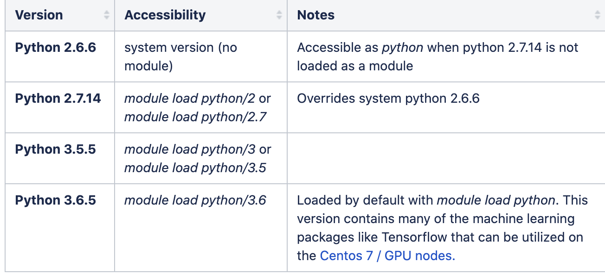
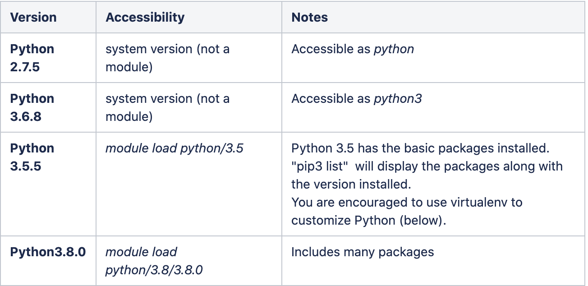
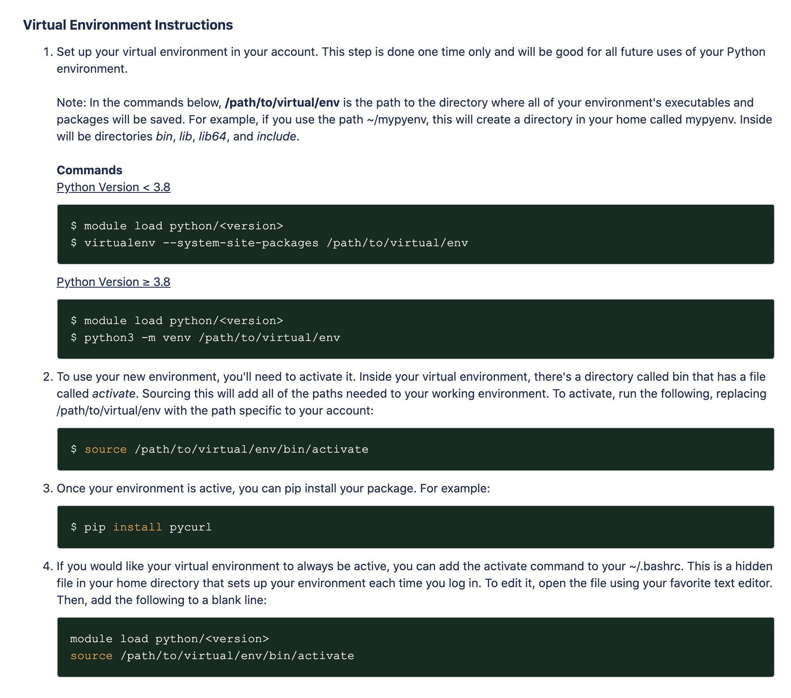
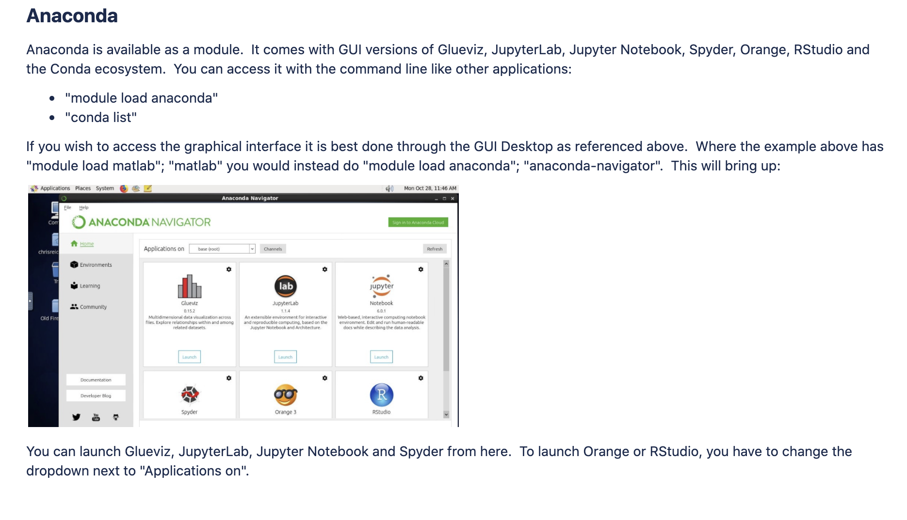
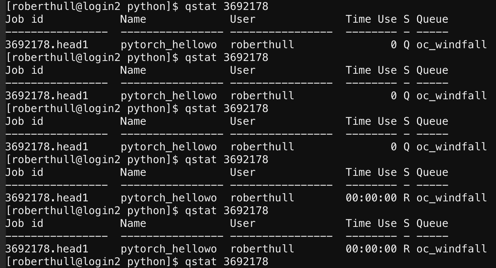

# UA HPC Information

**_Laura Condon, Oct, 2018 (Updated) Quinn Hull, Nov 2020_**

**_(Updated) Rachel Spinti, Feb 2021_**

## Description
  Running notes with links and tips for running on the UA HPC system.  Feel free to update and add to this document as needed. 


## Ocelot Quick Start

A good starting point. Tutorial highlights essential steps in running a basic job on HPC Ocelot.


1. How to log in
2. What a login node is
3. What a job scheduler is 
4. How to access software
5. How to run a job on HPC

[https://public.confluence.arizona.edu/display/UAHPC/Ocelote+Quick+Start](https://public.confluence.arizona.edu/display/UAHPC/Ocelote+Quick+Start) 


## Puma Quick Start:

Tutorial highlights essential steps in running a basic job on HPC Puma.


1. How to log in
2. What a login node is
3. How to access software (Note: it is different than Ocelote, see [https://public.confluence.arizona.edu/display/UAHPC/Puma+Quick+Start#PumaQuickStart-AccessingSoftware](https://public.confluence.arizona.edu/display/UAHPC/Puma+Quick+Start#PumaQuickStart-AccessingSoftware))
4. How to write a SLURM script
5. How to run a job on Puma

[https://public.confluence.arizona.edu/display/UAHPC/Puma+Quick+Start](https://public.confluence.arizona.edu/display/UAHPC/Puma+Quick+Start)


## UITS Account Management

To set-up a UA HPC account if you have not activated one. Sign-in and go to “Manage Your Accounts”

[https://account.arizona.edu/welcome](https://account.arizona.edu/welcome)


## HPC portal

[https://portal.hpc.arizona.edu](https://portal.hpc.arizona.edu/portal/?new0=lecondon)


## Logging in

`_ssh username@hpc.arizona.edu` (e.g. roberthull@hpc.arizona.edu)_

Should give you a choice to connect to Ocelote - if not you can type `menuon` to get the menu


* Type `ocelote` to enter the real HPC system


## HPC Browser Dashboard (OnDemand)

[https://ood.hpc.arizona.edu/pun/sys/dashboard](https://ood.hpc.arizona.edu/pun/sys/dashboard)

A GUI that allows you to monitor jobs and access files outside the terminal. Can be easier to view and/or edit files this way than in command line.


## Making a run script

To execute a ‘job’ (ex: execute tclsh script) on HPC, one must ‘submit’ a request using the scheduling software PBS. 

[https://public.confluence.arizona.edu/pages/viewpage.action?pageId=86409309](https://public.confluence.arizona.edu/pages/viewpage.action?pageId=86409309)


* PBS Overview: Jobs are submitted to the batch system using PBS scripts that specify the job's required resources such as number of nodes, cpus, memory, group, wallclock time. 

[https://jobbuilder.hpc.arizona.edu//](https://jobbuilder.hpc.arizona.edu//)


* This site is helpful to start, but is a bit outdated: see the example pbs script at the end of this doc for more detail

[https://public.confluence.arizona.edu/display/UAHPC/Ocelote+Quick+Start](https://public.confluence.arizona.edu/display/UAHPC/Ocelote+Quick+Start) 

A (very helpful) “hello world” tutorial including job submission via pbs script


## Link for computing account management

 **[https://account.arizona.edu/welcome](https://account.arizona.edu/welcome)**


## Instructions for setting up and account

[https://public.confluence.arizona.edu/display/UAHPC/Account+Creation](https://public.confluence.arizona.edu/display/UAHPC/Account+Creation) 


## Accessing Software via Module commands

**[https://docs.hpc.arizona.edu/display/UAHPC/Accessing+Software](https://docs.hpc.arizona.edu/display/UAHPC/Accessing+Software)**

`Module list`  (gives loaded modules)

`Module avail` (gives list of all modules)

`Module show NAME` (gives info on a specific module 


## Storage and limits

[https://docs.hpc.arizona.edu/display/UAHPC/Allocation+and+Limits](https://docs.hpc.arizona.edu/display/UAHPC/Allocation+and+Limits)

50GB on `home/uxx/netid` (ex home/u8/roberthull)

200GB (no Backups) on extra/netid

`/temp` - 840GB available per node. You can use this during the job and then do a final write to a shared array. (You cannot permanently save anything to this location)

No more than 600files/GB ~1.6 MB per file


There is a total time limitation for our group (36,000 hours/month), use command _va_ to check the remaining time of the month.


## Uploading files to UAHPC:

[https://public.confluence.arizona.edu/display/UAHPC/Transferring+Files](https://public.confluence.arizona.edu/display/UAHPC/Transferring+Files) 


1. (small files) Use the GUI web terminal [https://ood.hpc.arizona.edu/pun/sys/dashboard](https://ood.hpc.arizona.edu/pun/sys/dashboard)
    1. [Log on](https://ood.hpc.arizona.edu/pun/sys/dashboard)
    2. [Click ‘Files’ in top left corner ](https://ood.hpc.arizona.edu/pun/sys/dashboard)
    3. Select Directory to which you want to add files (e.g. 
    4. Click `Upload` and navigate to the local file location.
    5. To use the file, navigate to the file location by clicking`Open in terminal`

2. (big files &lt;100 GB). Use sftp, scp or rsync using filexfer.hpc.arizona.edu

    Copy your files through through the transfer node like below: 


        _scp -rp file.txt &lt;netid>[@filexfer.hpc.arizona.edu](mailto:lecondon@filexfer.hpc.arizona.edu):&lt;directory>_


    Example: If I (roberthull) want to upload a python script (test.py) to my home directory (/home/u8/roberthull) the command would look like the below


        _scp -rp test.py roberthull[@filexfer.hpc.arizona.edu](mailto:lecondon@filexfer.hpc.arizona.edu):_/home/u8/roberthull


    \*\*\* **Remember that on all HPC systems your files will be purged after a certain amount of time it is your job to be aware of the purge policies and copy your outputs somewhere appropriate for longer term storage.**


    \*\*\* **Note as shown above scp requires [http://filexfer.hpc.arizona.edu/](http://filexfer.hpc.arizona.edu/) rather than [hpc.arizona.edu](http://hpc.arizona.edu/)**


## Monitoring jobs

**[https://public.confluence.arizona.edu/pages/viewpage.action?pageId=86409309](https://public.confluence.arizona.edu/pages/viewpage.action?pageId=86409309**

*Note `qstat -u`  will truncate the job_id to get it not to do this you need to use

`qstat -antsw1u lecondon`


## Getting started

Steps for getting started and running your first job:

1. Get an account see instructions above
2. Login `ssh username@hpc.arizona.edu` - _remember when you first login you need to type the correct number to actually get into Ocelote 
3. Build ParFlow on Ocelote (follow the instructions below)
4. Upload your files to the directory you want to run in. Look at the storage limits links above to learn about the places you can store files. Your home directory is VERY small 50GB so you don’t want to keep to much here but it’s a good place to put things that you don’t want to be deleted. The ‘extra’ directory has more space and is a better place to run. You can copy your files using the scp command through the filexfer node like this:

    `scp -rp file.txt [lecondon@filexfer.hpc.arizona.edu](mailto:lecondon@filexfer.hpc.arizona.edu):/extra/lecondon/wash_base`


    \*\*\* **Remember that on all HPC systems your files will be purged after a certain amount of time it is your job to be aware of the purge policies and copy your outputs somewhere appropriate for longer term storage. **


    \*\*\* **Note as shown above scp requires [http://filexfer.hpc.arizona.edu/](http://filexfer.hpc.arizona.edu/) rather than [hpc.arizona.edu](http://hpc.arizona.edu/)**

5. Build a run script. You can’t just tclsh on a HPC machine you need to ‘submit’ your job to request time and specify how much resources you will need. See the example run scripts below and the link above for generating a run script.  

    Note: There are different queues that you can submit to. If you just want to test something quickly the debug queue is a good option. You can read about the different queues in the storage and limits section and see an example of a debug submission below

6. Submit your job to the queue by running the qsub command on the run script you just created. 

        qsub myrunscrp.pbs

7. Minitor your job. You can see when your job starts running and finishes using the commands in the run monitoring section. 
8. Copy your outputs back to your local machine using scp commands like in step four or upload to cyverse using irods commands.  


## ParFlow on UAHPC

**Running with an existing version of ParFlow**

_If you want to run with one of the versions of ParFlow that has already been build just add these lines to your bashrc and make sure that you aren’t also setting ‘PARFLOW_DIR’ in in your bashrc file. _

```bash
ssh [username@hpc.arizona.edu](mailto:username@hpc.arizona.edu)

cd $HOME

vi ~/.bashrc

# Add the following lines to this file

module load unsupported

module load lecondon/parflow/latest

# You can check if things look right using the commands

which parflow

echo $PARFLOW_DIR
```

**Adding a new ParFlow Module**

Refer to the README file in:  `/unsupported/lecondon/parflow/`

**These are the old instructions for building ParFlow with Autoconf. Ignore these and use the CMAKE ones**

Download ParFlow

`git clone  https://github.com/parflow/parflow`

Rename this directory to whatever you want

Setup environment

`vi ~/.bashrc`

Add the following lines to the user specified portion:

    module load gcc

    module load hypre

    module load silo

    export PARFLOW_DIR=/home/PATH_TO_YOUR_PARFLOW_DIR

    PATH=$PATH:$PARFLOW_DIR/bin

`source ~/.bashrc`

Build ParFlow

```bash
cd pfsimulator

./configure  --prefix=$PARFLOW_DIR --with-amps=mpi1 --with-clm --with-hypre=$HYPRE_BASE --with-silo=$SILO_BASE --with-amps-sequential-io

make -j 14_

_make install_

_Build PFtools_

_cd ../pftools_

_./configure  --prefix=$PARFLOW_DIR --with-amps=mpi1 --with-clm --with-hypre=$HYPRE_BASE --with-silo=$SILO_BASE --with-amps-sequential-io_

make -j 14

make install
```

Run tests
```bash

cd ../test

make check
```

## Example pbs script

This is an example of what a job submit script should look like. You can generate one based off of this or using the link above

```bash
# Your job will use 1 node, 8 cores, and 48gb of memory total.

#PBS -q standard

#PBS -l select=1:ncpus=16:mem=48gb:pcmem=6gb

### Specify a name for the job

#PBS -N test

### Specify the group name

#PBS -W group_list=lecondon

### Walltime is how long your job will run

#PBS -l walltime=00:50:00

### Joins standard error and standard out

#PBS -j oe


cd /home/u18/lecondon/Test/washita/tcl_scripts

tclsh Dist_Forcings.tcl

tclsh LW_Test.tcl
```

**_Note: the “place=pack:shared” and “cput” lines in the HPC job builder guide website are no longer necessary as of July 2019. _**


## SLURM scripts

Puma uses SLURM to submit jobs instead of PBS. The link above has a PBS to SLURM Rosetta stone, so you can convert your PBS script. Otherwise, the Puma Quick start guide contains a sample SLURM script ([https://public.confluence.arizona.edu/display/UAHPC/Puma+Quick+Start#PumaQuickStart-WritingaSLURMSubmissionScript)](https://public.confluence.arizona.edu/display/UAHPC/Puma+Quick+Start#PumaQuickStart-WritingaSLURMSubmissionScript)).


## Debug queue

The debug queue is a high-priority queue with a short runtime that is used to debug your runs before sending them to the standard or other queue. More information can be found here: 

[https://docs.hpc.arizona.edu/display/UAHPC/Allocation+and+Limits](https://docs.hpc.arizona.edu/display/UAHPC/Allocation+and+Limits)

**Example pbs script for debug queue (comments are in `{}` and not to be included in script):**

```bash
# Your job will use 1 node, 8 cores, and 48gb of memory total.

#PBS -q debug		{changing specified queue to the debug queue}

#PBS -l select=1:ncpus=16:mem=48gb:pcmem=6gb	

{cannot exceed 2 nodes or 56 total cores}

### Specify a name for the job

#PBS -N test

### Specify the group name

#PBS -W group_list=lecondon

### Walltime is how long your job will run

#PBS -l walltime=00:10:00		{walltime cannot exceed 10 minutes}

### Joins standard error and standard out

#PBS -j oe
```

Once the job has been submitted to the debug queue and been executed, the error and output messages for the job will indicate whether the job ran for the total allotted time or ran into an error before then.


## Time Allocation

Each PI has a finite amount of time allocation each month. After each run completes, the _run_name.o####### _file will show the amount of time left in the standard queue each month. Each time you submit a script, the system makes sure that your request can be fulfilled in the given queue - otherwise, it returns an error message. If you’re requesting more time than you have for the rest of the month, you can: 1) reduce the amount of time you are requesting, 2) submit it to the windfall queue, or 3) wait until the end of the month and try again next month. Your advisor may not be okay with you trying option 3.


## Accessing and using software (like Python) 

General: [https://public.confluence.arizona.edu/display/UAHPC/Accessing+Software](https://public.confluence.arizona.edu/display/UAHPC/Accessing+Software) 

Python: [https://public.confluence.arizona.edu/display/UAHPC/Using+and+Installing+Python](https://public.confluence.arizona.edu/display/UAHPC/Using+and+Installing+Python) 

Conda: [https://public.confluence.arizona.edu/display/UAHPC/Open+On+Demand](https://public.confluence.arizona.edu/display/UAHPC/Open+On+Demand) 

**Summary: **Many software are installed on the server (> 100). Note that both Python and Anaconda exist, which allow for the installation of Python packages and usage of conda virtual environments. 


## Python:

There are four versions of Python on Ocelote, (up to Python 3.6.5). 

	Python 3.6.5 is loaded with ‘module load python’, and includes machine learning packages like Tensorflow. (Does it include PyTorch?)




There are three versions of Python in ElGato (up to Python 3.8.0).

	Python 3.8.0 is loaded with ‘module load python/3.8/3.8.0’





There are two versions of Python in Puma (up to Python 3.8.2)


* Note that for DL software, Puma is best
* [https://public.confluence.arizona.edu/display/UAHPC/Puma+Quick+Start](https://public.confluence.arizona.edu/display/UAHPC/Puma+Quick+Start) 


## Virtual Environments

	It is useful to set up a virtualenv within your working directory. 





## Conda

	Anaconda is available as a module, with its requisite packages and access to virtual environments (too?)




Look at Conda Environments: `conda env list`

Create Conda Environments: `conda create --name -myenv`

Activate Conda Environments: `conda activate` and `conda deactivate`

## How to do a basic script in Python

1. Log in via terminal or bash
    - see the "Logging In" section
2. Find Python modules
    - `module avail python`
    - This will list availalbe python modules. e.g. `python/3.6/3.65`
3. Load Python
    - `module load python/3.6/3.65`
4. Add/Create/Locate the script you want to run
    `pytorch_helloworld.py` -> `print("hello world")`
5. Create and edit pbs script (note important fields)
    
        touch pytorch_helloworld.pbs
        vim pytorch_helloworld.pbs


```
# --------------------------------------------------------------
### PART 1: Requests resources to run your job.
# --------------------------------------------------------------
### Optional. Set the job name
#PBS -N pytorch_helloworld
### REQUIRED. Specify the PI group for this job
#PBS -W group_list=lecondon
### Optional. Request email when job begins and ends
### PBS -m bea
### Optional. Specify email address to use for notification
### PBS -M roberthull@email.arizona.edu
### REQUIRED. Set the queue for your job.
#PBS -q windfall
### REQUIRED. Set the number of nodes, cores and memory that will be used for this job
### pcmem is optional as it defaults to 6gb per core. Only required for high memory = 42gb.
#PBS -l select=1:ncpus=1:mem=6gb:pcmem=6gb
### REQUIRED. Specify "wallclock time" required for this job, hhh:mm:ss
#PBS -l walltime=0:1:0
### Optional. cput = time x ncpus. Default: cput = walltime x ncpus.
#PBS -l cput=0:1:0
# --------------------------------------------------------------
### PART 2: Executes bash commands to run your job
# --------------------------------------------------------------
### Load required modules/libraries if needed
module load python/3.6/3.6.5
### change to your scripts directory
cd ~/python
### run your work
python3 pytorch_helloworld.py
sleep 10i

```

6. Submit job via qsub
    `qsub pytorch_helloworld.pbs3592178.head1.cm.cluster`

7. Follow job progression via qstat




8. View results of job  `<jobname>.o<number>` for results, `<jobname>.e<number> for errors
    - Look at results: `vim pytorch_helloworld.o3692196` -> `hello world`
    - If there are errors use: `vim pytorch_helloworld.e3692196`


## How to run a more complicated Python script in terminal on UAHPC


1. Log in via terminal or bash (go to Ocelote)
    - See the "Logging in" section
2. Log in via terminal or bash
    - see the "Logging In" section
3. Find Python modules
    - `module avail python`
    - This will list availalbe python modules. e.g. `python/3.6/3.65`
4. Load Python
    - `module load python/3.6/3.65`
	- Take care that you load the version of python that you need. That includes considerations of what packages are available via UAHPC, and how you’ve installed custom packages in your virtual environment
	- Also, you can check what python versions are available and/or are loaded using `module list`
5. Activate your virtual environment (create it if necessary)
    - `virtualenv --system-site-packages ~/mypyenv_oc_py.3.6`
    - `source ~/mypyenv_oc_py3.6/bin/activate`
    - Take care to use a virtual environment compatible with your version of python and with your super computer of choice (Ocelote v ElGato)
6. Add/Create/Locate the script you want to run
    - `Pytorch_gpus.py`  →   runs a simple gpu script
    - Note if you use custom packages you will need to manually reference the location of your virtual environment in the following way within your python script:


7. Check which packages you have in your virtual environment, `pip list` (note that python/3.6/3.6.5 for ocelote has almost everything you would ever want to have…)
8. Install any packages that you think you need to run your desired script
    - `pip install <name_of_package>`
9. Create and edit pbs script (note important fields)

```bash
#!/bin/bash 

# --------------------------------------------------------------

### PART 1: Requests resources to run your job.

# --------------------------------------------------------------

### Optinal. Set the job name

#PBS -N pytorch_gpus_n1

### REQUIRED. Specify the PI group for this job

#PBS -W group_list=lecondon

### Optional. Request email when job begins and ends

### PBS -m bea

### Optional. Specify email address to use for notification

### PBS -M &lt;YOUR NETID>@email.arizona.edu

### REQUIRED. Set the queue for your job.

#PBS -q windfall

### REQUIRED. Set the number of nodes, cores and memory that will be used for this job

### pcmem is optional as it defaults to 6gb per core. Only required for high memory = 42gb.

#PBS -l select=1:ncpus=1:mem=6gb

### REQUIRED. Specify "wallclock time" required for this job, hhh:mm:ss

#PBS -l walltime=0:1:0

### Optional. cput = time x ncpus. Default: cput = walltime x ncpus.

#PBS -l cput=0:1:0

# --------------------------------------------------------------

### PART 2: Executes bash commands to run your job

# --------------------------------------------------------------

### Load required modules/libraries if needed

module load python/3.6/3.6.5

#### Activate virtual environment

source ~/mypyenv_oc_py3.6/bin/activate

### change to your script’s directory

cd ~/python

### Run your work

python3 pytorch_gpus.py

sleep 10
```


* A quick note about Requesting Resources and Node Types (Standard, GPU, or High Memory) via the select statement. The basic `select statement is:

        #PBS -l select=x:ncpus=Y:mem=Zgb

        Where:
         x = The number of nodes or units of the resources required
         Y = The number of cores (individual processors) required on each node
         Z = The amount of memory (in mb or gb) required on each node 

‘Normal’ Requests

        Ocelote
            For Ocelote all of the standard nodes have 28 cores and 6GB per core, pcmem=6gb can be added to the line or left off, and it will default to 6gm. The following select statement would request one complete node:

             #PBS -l select=28:ncpus=28:pcmem=6gb

            This is an example of a job that uses two nodes

            #PBS -l select=2:ncpus=28:mem=16gb

        El Gato
            On El Gato all of the standard nodes of 16 cores and 4GB per core. The maximum available memory on a standard El Gato node is 62GB, leaving the differences for the operating system. The following select statement would request one complete node
             
             #PBS -l select=1:ncpus=16:pcmem=4gb


‘GPU’ Requests

        Ocelote
            On Ocelote there are 46 Nvidia P100 nodes available with 28 cores and 224 GB of memory. Users of these nodes can use either their standard allocation of cpu hours or windfall time. Jobs that do not need GPU's will not run on them, including windfall jobs taht do no need the GPU. EAch job will have exclusive access to the node to prevent contention between the CPU cores and the GPU. Each group is limited to ten GPU nodes concurrently.
            
            This requests a CentOs 7 GPU node:
                #PBS -l select=1:ncpus=28:mem=224gb:np100s=1:os7=True

                or

                #PBS -l select=1:ncpus=28:mem=224gb:ngpus=1:os7=True

            This requests a CentOS 6 GPU node:

                #PBS -l select=1:ncpus=28:mem=224gb:np100s=1

            Ocelote has a single node with two GPUs that may be requested with

                #PBS -l select=1:ncpus=28:mem=224gb:np100s=2

        El Gato
            Unlike Ocelote, El Gato has cgroups enabled which allows for selecting a partial GPU node. Memory requests should be scaled by ncpusx16gb. To request a full GPU node:

                #PBS -l select=1:ncpus=16:mem=250gb:ngpus=1:pcmem=16gb
            
            To request a single node with two GPUs:

                #PBS -l select=1:ncpus=16:mem=250gb:ngpus=2:pcmem=16gb


An example of a GPU pbs using pytorch is as follows

```bash
#!/bin/bash

# --------------------------------------------------------------

### PART 1: Requests resources to run your job.

# --------------------------------------------------------------

#PBS -q standard

#PBS -l select=1:ncpus=28:mem=168gb:pcmem=6gb:np100s=1:os7=True

### Specify a name for the job

#PBS -N pytorch_gpus_single3

### Specify the group name

#PBS -W group_list=lecondon

### Walltime is how long your job will run

#PBS -l walltime=00:05:00

# --------------------------------------------------------------

### PART 2: Executes bash commands to run your job

# --------------------------------------------------------------

### Load required modules/libraries if needed

module load python/3.6/3.6.5

### In case needed for gpu..?

module load pytorch/nvidia/20.01

### Activate virtual environment

source ~/mypyenv_oc_py3.6/bin/activate

### change to your script’s directory

cd ~/python

### Run your work

singularity exec --nv /cm/shared/uaapps/pytorch/20.01/nvidia-pytorch.20.01-py3.simg python pytorch_gpus.py

sleep 10
```

10. Submit job via qsub
    - `qsub pytorch_gpus_n1.pbs2708168.head1.cm.cluster`
11. Follow job progression via qstat
    - `qstat pbs2708168`
12. View results of job `<jobname>.o<number>` for results, `<jobname>.e<number>` for errors


## How to run Python in a Jupiter notebook on UAHPC

It might be easiest to run Python using a Jupyter Notebook, for which UAHPC has developed super convenient GUIs. Check [here](https://public.confluence.arizona.edu/display/UAHPC/Jupyter+Notebook+-+Python) for a great tutorial. 
