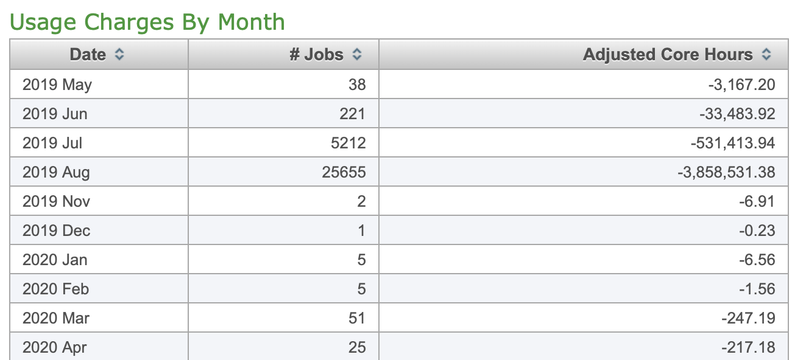

# Running on Cheyenne (NCAR)

**Amanda Triplett **

**Original: **12/2019

**Update: **08/2020


## Description

** **This gives an overview with examples of how to remotely access HPC resources at NCAR (specifically Cheyenne), update your bash profile and modules, an example job_script with the commands Cheyenne needs to run, how to run and check your job as well as useful information to transfer and edit your files. 


## Software

No specific software is needed, you do need an account with NCAR and an HPC time allotment in order to access resources. Everything can be done through your terminal. 


## Accessing and logging in to Cheyenne 


    Open your terminal and type the following: 


    1. ssh -Y -l “your_username” cheyenne.ucar.edu
        1. _Note:_ Macs often need the -Y and -l commands
        2. If it asks if you want to continue connecting, say yes
    2. Enter your password 
        3. You probably already set up duo when you set up your account, look on NCARs website for Cheyenne or call the help desk
    3. You’re logged in!

    Go to your scratch folder

    4. Every user starts with a scratch folder under their username, once you navigate here, you can create file directories just as you do on your own computer
        4. cd /glade/scratch/”your_username”
        5. Mkdir “new_directory_name”


## Updating your bash profile and loading modules


1. Make any necessary updates to your bash profile, directions below are requiredif you want to run ParFlow - you should only need to do this **once** and make sure you go to your scratch folder **first**
    5. `vim ~/.bash_profile`
    6. `export PARFLOW_DIR=/glade/p/univ/ucsm0002/parflow3.7_0826_2020/parflow`
    7. `export HYPRE_DIR=/glade/p/univ/ucsm0002/hypre/2.10.1`
    8. `export SILO_DIR=/glade/p/univ/ucsm0002/silo/4.10.2`
    9. `source ~/.bash_profile`

     2. Make sure correct modules are loaded


1. _Note:_ This may not always be necessary to do manually, but if you get errors such as mpi not loading correctly, load all the modules and see if that solves the problem. You **do **have to re-load the modules each time.
2. Type command: `module list` 
        a. You’ll probably see something like below if you haven’t made any changes:
        b. _Currently Loaded Modules:_
            1. _1) ncarenv/1.3   2) intel/18.0.5   3) ncarcompilers/0.5.0   4) mpt/2.19   5) netcdf/4.6.3_

3. Load the modules you need (example. below) 


        c. aktriplett@cheyenne4:/glade/scratch/aktriplett> module load cmake
        8. aktriplett@cheyenne4:/glade/scratch/aktriplett> module load nco
        e. aktriplett@cheyenne4:/glade/scratch/aktriplett> module load ncl
        f. aktriplett@cheyenne4:/glade/scratch/aktriplett> module load ncview
        g. aktriplett@cheyenne4:/glade/scratch/aktriplett> module load R
        h. aktriplett@cheyenne4:/glade/scratch/aktriplett> module list

4. After you load the modules your list will look like this: 


        Currently Loaded Modules:


        1) ncarenv/1.3    3) ncarcompilers/0.5.0   5) netcdf/4.6.3   7) nco/4.7.9   9) ncview/2.1.7


        2) intel/18.0.5   4) mpt/2.19              6) cmake/3.14.4   8) ncl/6.6.2  10) R/3.6.0


## Getting files to and from Cheyenne using scp

**NOTE:** This is an inferior method to using **Globus**, see the getting started on Globus notes in the Methods section.


1. Getting files to Cheyenne
    1. To copy from **your** computer **to** Cheyenne:
        1. Navigate to the folder where your file is
        2. scp `“your_file_name” “your_user_name”@data-access.ucar.edu:/glade/scratch/”your_user_name”/”the rest of the path to where you want the file”`
    2. To copy **from** Cheyenne **to your** computer
        3. Navigate to the folder where you want the files
        4. `scp “your_user_name”@data-access.ucar.edu:/glade/scratch/”your_user_name”/”the rest of the path to where you want the file”` .
        5. You can use a `*.{“file_ext”}` to scp multiple files of the same type
            1. `scp “your_user_name”@data-access.ucar.edu:/glade/scratch/”your_user_name”/”the rest of the path to where you want the file”/*.{file_ext1, file_ext2}` .
    3. Moving files within Cheyenne
        6. Navigate to where the file is now
        14.`mv “file_name” “destination_file_path”`


## Editing and Saving Files within Cheyenne


1. To open a file 
    1. `vi “file_name”`
    2. To make a change, type `i` for insert 
    3. Click escape to stop making changes 
    4. Type `zz `to save
    5. Type `shift zz` to save and exit 
    6. Type `:x` to exit without saving 


## Job Scripts, running your TCL, checking your status and killing your job 


1. You need a job_script for Cheyenne to run your job. There will be a tclsh call at the end of this that will call your tcl script and run your job. 
    1. Below is an example job script

```bash
#!/bin/bash

#PBS -N HRB_PLtest1 -> this is what your run will be called

#PBS -A UCSM0009 -> your award number

#PBS -l walltime=01:00:00 -> clock time before your script is killed

#PBS -q regular -> specify your queue, r is regular but there is also debug

#PBS -j oe

#PBS -o log1.oe -> name of the run log file you get

#PBS -m abe

#PBS -M [aktriplett@email.arizona.edu](mailto:aktriplett@email.arizona.edu) -> add this line to get run e-mail updates

#PBS -l select=12:ncpus=36:mpiprocs=36 -> the processors or computing resources you are requesting
```

### Run the executable

`tclsh HRB_parkinglot.tcl` -> the name of your tcl script


2. Useful link with info about anatomy and making of pbs scripts:
    2. [https://www.scribd.com/document/359446973/PBS-Queue-Commands](https://www.scribd.com/document/359446973/PBS-Queue-Commands)
3. Commands for run scripts
    3. qsub “script_name” 
        1. This runs your job
    4. `qstat -u “your_username”` 
        2. Check on the status of your job 
        3. Add `alias qjobs="qstat -u $USER"` to your bash profile to check your job status using ‘qjobs’

     c.`Qdel “job_number”`


    i. Kill your job


## Checking your Core Hour Usage


1. Follow this link to the Systems Accounting Manager (SAM) system 
    1. [Sam.ucar.edu](https://sam.ucar.edu/app/home)
    2. You can also look at this link for additional information about what is available on SAM 
        1. [https://www2.cisl.ucar.edu/user-support/systems-accounting-manager](https://www2.cisl.ucar.edu/user-support/systems-accounting-manager)
2. Log-in to the SAM system using your regular log-in info, you will have to authenticate with Duo push as well
3. One logged in, you can go to the reports tab to track your usage activity, it will look something like this:





## Misc. info


1. Information about where to store / what directories to make can be put in the tcl script, it will make whatever folder / file tree you specify in your scratch directory
2. The amount of storage available on the scratch directory shouldn’t be an issue for most runs
3. To transfer files to and from the scratch directory, you can just scp from the scratch folder to home computer and back again, there is no special node to do this on or way like the UAHPC
4. You can check log outputs to see if there are any errors


## Installing icommands on Cheyenne

It is possible to install icommands on Cheyenne without any additional privilege in your own directory. _Icommands if NOT natively installed on Cheyenne unlike UAHPC. _Detailed can be found here, [https://wiki.cyverse.org/wiki/display/DS/Setting+Up+iCommands#SettingUpiCommands-co](https://wiki.cyverse.org/wiki/display/DS/Setting+Up+iCommands#SettingUpiCommands-co)


1. Download the installer to your local computer (links can be found in [https://wiki.cyverse.org/wiki/display/DS/Setting+Up+iCommands#SettingUpiCommands-co](https://wiki.cyverse.org/wiki/display/DS/Setting+Up+iCommands#SettingUpiCommands-co)) and upload to your directory in Cheyenne.
    1. Download the **ubuntu 14 version for unprivileged users**
2. In your Cheyenne directory with the installer, type or copy command:

    ```
    sh irods-icommands-4.1.10-ubuntu-14.installer
    ```


    Then you will see:

            Where would you like to install it? [/home/cyverse-user]
            Expanding contents under /home/cyverse-user.
            Updating .bashrc
            done!


3. To make the changes take effect in the current shell, you will need to source your .bashrc file (`vim ~/.bash_profile`). The following lines should be added:


```
# iRODS iCommands support
export  IRODS_PLUGINS_HOME=/glade/u/home/yourusername/icommands/plugins/
export PATH=/glade/u/home/yourusername/icommands:$PATH

```


4. Open a new terminal window, if necessary, and run `ienv` to check that the new version was installed.
5. initialise your account:

        _iinit_


        [data.cyverse.org](http://data.cyverse.org/)


        Port: 1247


        User: yourusername


        Zone: iplant


        Then enter your cyverse password

6. Then you can start use icommands.


## Running with Python on Cheyenne


* General instructions of how to get running with python can be found at: 
    * [https://www2.cisl.ucar.edu/resources/python-–-ncar-package-library](https://www2.cisl.ucar.edu/resources/python-–-ncar-package-library)

- In order to install your own packages, you will have to create your own virtual environment after following the steps in the above page and then activate as follows: 

	- NOTE: You do not have permission to write in the ncar virtual env, so to install packages not included there, you have to create your own

       `ncar_pylib -c 20201220 /glade/work/$USER/my_npl_clone`


```
    ncar_pylib my_npl_clone
    pip --no-cache-dir install PACKAGE_NAME

```


* If your virtualenv stops working, you may have to delete it and create a new one, just follow the above steps again and you should be good


## Building a New Version of ParFlow on Cheyenne (08/2020) from MM at CSM

_Adding specific ParFlow Builds to your bash profile. This is an example for a specific version, you need to add the path to the version you want to use after export:_

`vim ~/.bash_profile`.


```
export PARFLOW_DIR=/glade/p/univ/ucsm0002/parflow_build/parflow #(this is the folder where you will put the new version of Parflow)
export HYPRE_DIR=/glade/p/univ/ucsm0002/hypre/2.10.1
export SILO_DIR=/glade/p/univ/ucsm0002/silo/4.10.2
```


_Build instructions_

_Please load the following modules:_


```
module load impi
module load intel/17.0.1
module load cmake
```


To see which modules are available, use command `module avail`. To check which modules you have loaded, you can use  `module list`. For me, this returns:


```
Currently Loaded Modules:
1) ncarenv/1.3    3) ncarcompilers/0.5.0   5) cmake/3.14.4       7) nco/4.7.9      9) netcdf/4.6.3
2) intel/17.0.1   4) impi/2017.1.132       6) ncl/6.6.2    (H)   8) ncview/2.1.7  10) R/3.6.0
```


I was able to follow the typical installing directions for Silo and Hypre (from the parflow blog) and set them in my bash profile. 

Then just follow the cmake workflow for installing parflow:

`cd ~/glade/p/univ/ucsm0002/parflow_build     `(or wherever)


```
git clone -b master http://github.com/parflow/parflow.git 
```


`export PARFLOW_DIR=~//glade/p/univ/ucsm0002/parflow_build/parflow  `(or wherever. Add to bash_profile.)


```bash
cd $PARFLOW_DIR
mkdir build
cd build

cmake .. -DCMAKE_INSTALL_PREFIX=$PARFLOW_DIR -DPARFLOW_AMPS_LAYER=mpi1 -DPARFLOW_ENABLE_TIMING=TRUE -DHYPRE_ROOT=$HYPRE_DIR -DSILO_ROOT=$SILO_DIR -DPARFLOW_HAVE_CLM=ON -DPARFLOW_AMPS_SEQUENTIAL_IO=TRUE

make
make install

```


1. Go to where you installed 